# Social Platform Integration Architecture

> **Version:** 1.0.0  
> **Last Updated:** December 2025  
> **Status:** Production Ready

This document provides a comprehensive overview of the social media platform integration architecture, including OAuth authentication, token management, content publishing, and data storage.

---

## Table of Contents

1. [System Overview](#system-overview)
2. [Supported Platforms](#supported-platforms)
3. [Architecture Components](#architecture-components)
4. [OAuth Authentication Flow](#oauth-authentication-flow)
5. [Token Management](#token-management)
6. [Content Publishing Flow](#content-publishing-flow)
7. [Database Schema](#database-schema)
8. [API Endpoints](#api-endpoints)
9. [Error Handling](#error-handling)
10. [Security Considerations](#security-considerations)

---

## System Overview

The social platform integration system enables users to:
- Connect multiple social media accounts via OAuth
- Publish content to multiple platforms simultaneously
- Manage tokens with automatic refresh
- Track publishing status and analytics

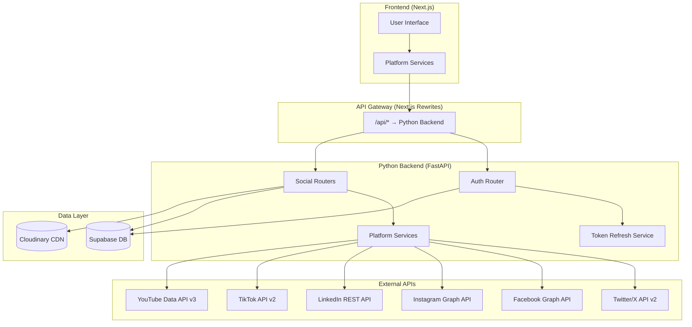

---

## Supported Platforms

| Platform | OAuth Type | Token Lifespan | Refresh Support |
|----------|------------|----------------|-----------------|
| **Twitter/X** | OAuth 2.0 PKCE | 2 hours | ✅ Yes |
| **Facebook** | OAuth 2.0 | 60 days | ✅ Yes (Long-lived) |
| **Instagram** | OAuth 2.0 (via Facebook) | 60 days | ✅ Yes |
| **LinkedIn** | OAuth 2.0 | 60 days | ✅ Yes |
| **TikTok** | OAuth 2.0 | 24 hours | ✅ Yes |
| **YouTube** | OAuth 2.0 | 1 hour | ✅ Yes (Indefinite refresh) |

---

## Architecture Components

### Backend Services

```
python_backend/src/
├── api/v1/
│   ├── auth.py              # OAuth initiation & callbacks
│   ├── credentials.py       # Credential management API
│   ├── token_refresh.py     # On-demand token refresh API
│   └── social/
│       ├── twitter.py       # Twitter posting endpoints
│       ├── facebook.py      # Facebook posting endpoints
│       ├── instagram.py     # Instagram posting endpoints
│       ├── linkedin.py      # LinkedIn posting endpoints
│       ├── tiktok.py        # TikTok posting endpoints
│       └── youtube.py       # YouTube posting endpoints
│
├── services/
│   ├── social_service.py           # Facebook/Instagram Graph API
│   ├── token_refresh_service.py    # Centralized token refresh
│   ├── oauth_service.py            # OAuth state management
│   └── platforms/
│       ├── twitter_service.py      # X API v2 client
│       ├── linkedin_service.py     # LinkedIn REST client
│       ├── tiktok_service.py       # TikTok API client
│       └── youtube_service.py      # YouTube API client
```

### Frontend Services

```
src/services/platforms/
├── BasePlatformService.ts    # Abstract base class
├── twitterService.ts         # Twitter integration
├── facebookService.ts        # Facebook integration
├── instagramService.ts       # Instagram integration
├── linkedinService.ts        # LinkedIn integration
├── tiktokService.ts          # TikTok integration
└── youtubeService.ts         # YouTube integration
```

---

## OAuth Authentication Flow

### 1. OAuth Initiation

User clicks "Connect" → Frontend calls backend → Backend generates OAuth URL → User redirected to platform.

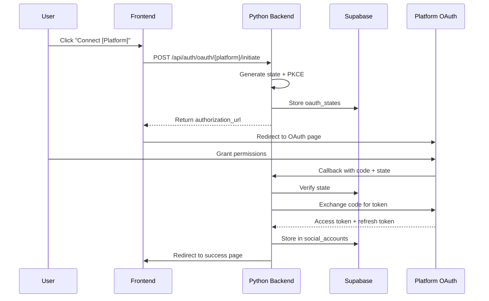

### 2. PKCE Flow (for Twitter)

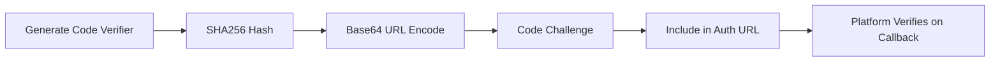

### 3. Token Exchange

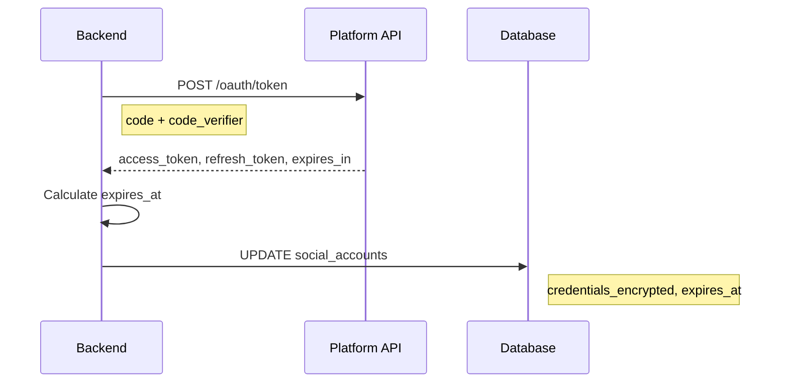

---

## Token Management

### On-Demand Refresh Strategy

The system uses **on-demand token refresh** - no cron jobs required.

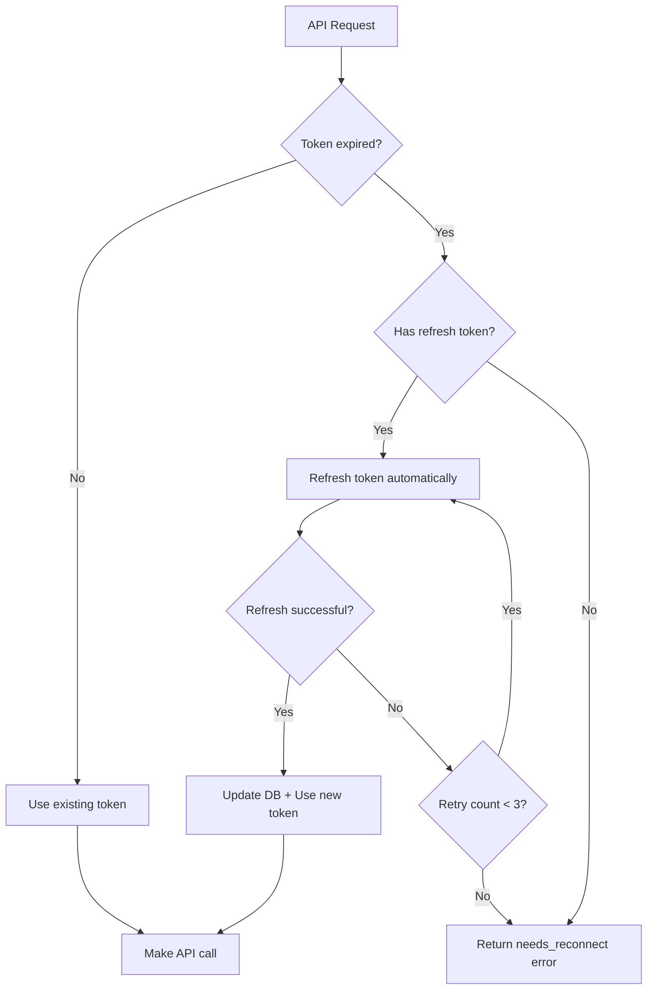

### Token Refresh Service Flow

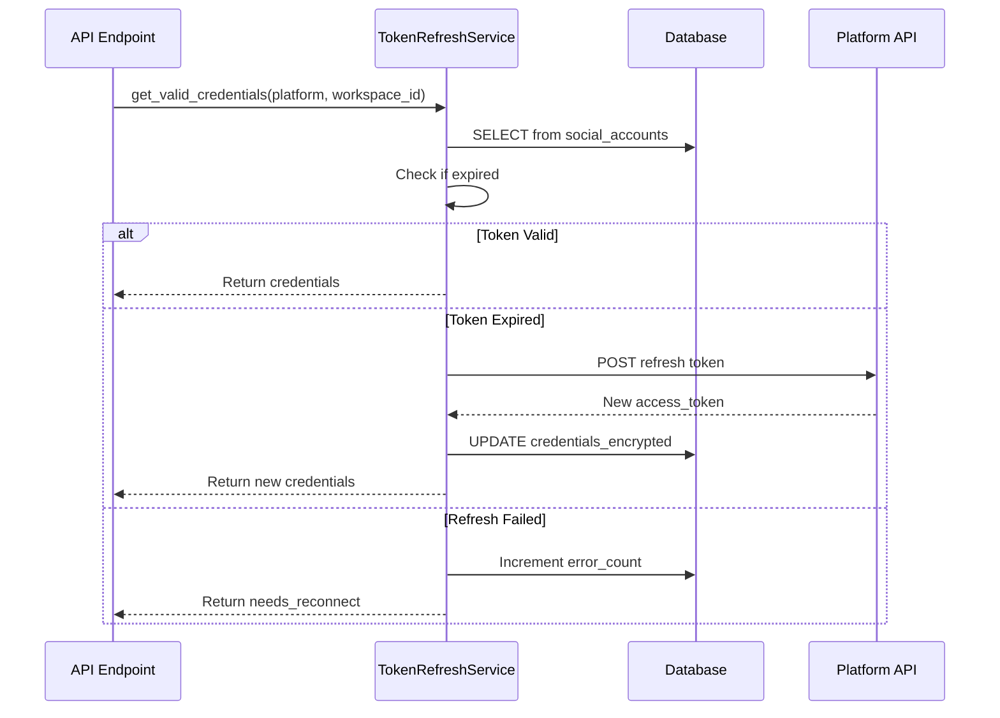

---

## Content Publishing Flow

### 1. Single Platform Post

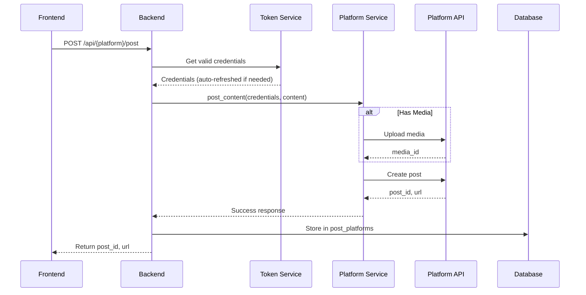

### 2. Multi-Platform Publishing

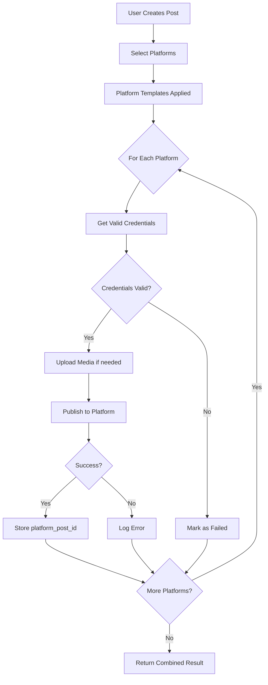

### 3. Platform-Specific Content Types

| Platform | Post | Image | Video | Carousel | Reel | Story |
|----------|------|-------|-------|----------|------|-------|
| Twitter | ✅ | ✅ | ✅ | ❌ | ❌ | ❌ |
| Facebook | ✅ | ✅ | ✅ | ✅ | ✅ | ✅ |
| Instagram | ✅ | ✅ | ✅ | ✅ | ✅ | ✅ |
| LinkedIn | ✅ | ✅ | ✅ | ✅ | ❌ | ❌ |
| TikTok | ❌ | ❌ | ✅ | ❌ | ❌ | ❌ |
| YouTube | ❌ | ❌ | ✅ | ❌ | ✅ (Shorts) | ❌ |

---

## Database Schema

### Core Tables

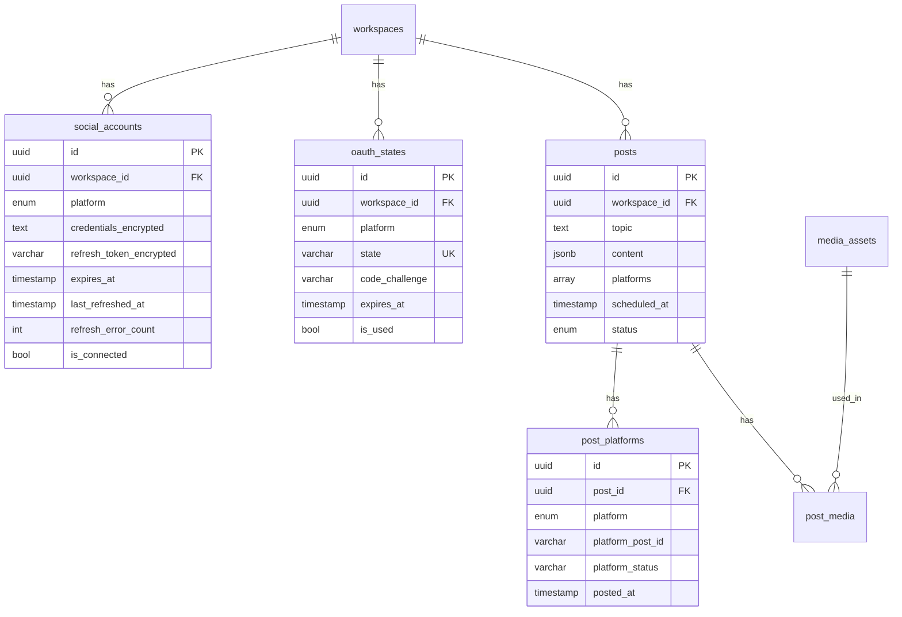

### Credentials Storage

Credentials are stored in JSONB format within `credentials_encrypted`:

```json
{
  "accessToken": "...",
  "refreshToken": "...",
  "expiresAt": "2025-01-28T00:00:00Z",
  "userId": "123456",
  "username": "@user",
  "pageId": "...",
  "pageName": "..."
}
```

---

## API Endpoints

### Authentication

| Method | Endpoint | Description |
|--------|----------|-------------|
| POST | `/api/auth/oauth/{platform}/initiate` | Start OAuth flow |
| GET | `/api/auth/oauth/{platform}/callback` | OAuth callback |

### Token Management

| Method | Endpoint | Description |
|--------|----------|-------------|
| GET | `/api/tokens/get/{platform}` | Get valid credentials (auto-refresh) |
| POST | `/api/tokens/refresh/{platform}` | Force token refresh |
| GET | `/api/tokens/status` | Get all token statuses |

### Credentials

| Method | Endpoint | Description |
|--------|----------|-------------|
| GET | `/api/credentials` | List connected accounts |
| GET | `/api/credentials/{platform}` | Get platform credentials |
| DELETE | `/api/credentials/{platform}` | Disconnect account |

### Publishing

| Method | Endpoint | Description |
|--------|----------|-------------|
| POST | `/api/twitter/post` | Post to Twitter |
| POST | `/api/facebook/post` | Post to Facebook |
| POST | `/api/instagram/post` | Post to Instagram |
| POST | `/api/linkedin/post` | Post to LinkedIn |
| POST | `/api/tiktok/post` | Post to TikTok |
| POST | `/api/youtube/upload` | Upload to YouTube |

---

## Error Handling

### Error Types

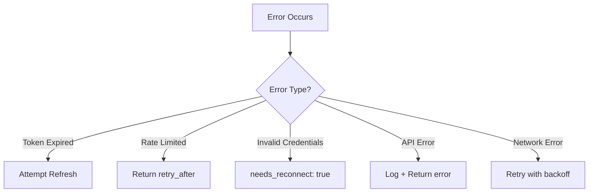

### Error Codes

| Code | Description | User Action |
|------|-------------|-------------|
| `token_expired` | Token needs refresh | Automatic |
| `refresh_failed` | Couldn't refresh token | Reconnect account |
| `rate_limited` | API rate limit hit | Wait and retry |
| `invalid_credentials` | Token revoked | Reconnect account |
| `platform_error` | Platform API error | Check platform status |

---

## Security Considerations

### Token Security

1. **Encryption at Rest**: Credentials stored encrypted in database
2. **PKCE**: Used for Twitter/X OAuth 2.0 flow
3. **State Validation**: OAuth state verified to prevent CSRF
4. **Short Expiry**: OAuth states expire in 10 minutes

### API Security

1. **JWT Authentication**: All API calls require valid JWT
2. **Workspace Isolation**: Users can only access their workspace data
3. **HTTPS Only**: All production traffic encrypted
4. **Rate Limiting**: API endpoints protected against abuse

### Best Practices

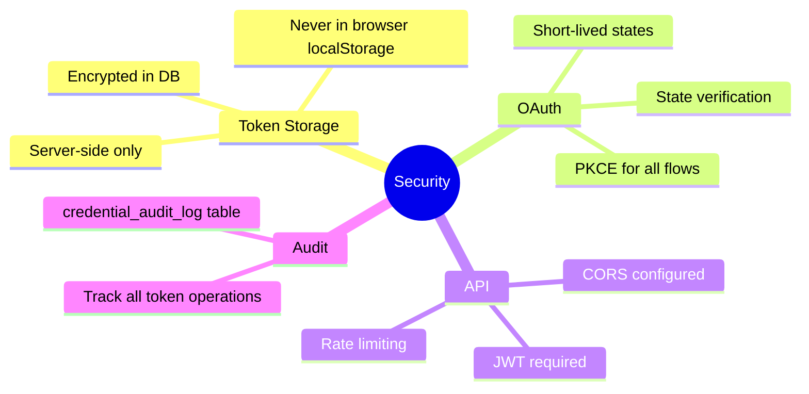

---

## Monitoring & Observability

### Health Checks

- `/api/tokens/health` - Token service health
- `/api/auth/` - Auth service status
- `/api/{platform}/info` - Platform API status

### Metrics to Track

| Metric | Description | Alert Threshold |
|--------|-------------|-----------------|
| Token refresh success rate | % of successful refreshes | < 95% |
| OAuth completion rate | % of successful connections | < 80% |
| Publishing success rate | % of successful posts | < 90% |
| API latency p99 | 99th percentile latency | > 5s |

---

## Appendix: Platform API Versions

| Platform | API Version | Documentation |
|----------|-------------|---------------|
| Twitter/X | v2 | [X API Docs](https://developer.twitter.com/en/docs/twitter-api) |
| Facebook | v24.0 | [Graph API Docs](https://developers.facebook.com/docs/graph-api) |
| Instagram | v24.0 (Graph API) | [Instagram API Docs](https://developers.facebook.com/docs/instagram-graph-api) |
| LinkedIn | v2 / REST | [LinkedIn API Docs](https://learn.microsoft.com/linkedin/) |
| TikTok | v2 | [TikTok API Docs](https://developers.tiktok.com/) |
| YouTube | v3 | [YouTube API Docs](https://developers.google.com/youtube/v3) |

---

*Document generated: December 2025*
